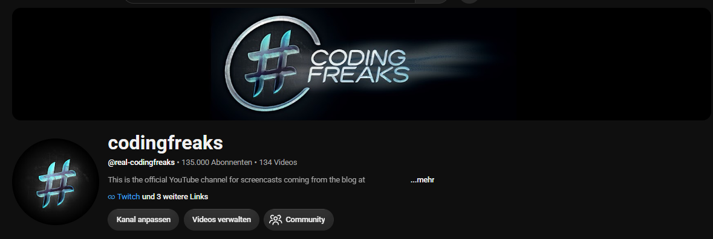

&nbsp;&nbsp;&nbsp;&nbsp;

# codingfreaks Youtube Channel samples

This repository provides sources I used in my videos published on my Youtube channel [@real-codingfreaks](https://www.youtube.com/@real-codingfreaks).

# About me

My name is Alexander and I am passionate about elegant solutions specifically when it comes to coding. My job is to be the technical lead at [DEVDEER](https://devdeer.com). I am a co-founder of this company which is concentrated on solutions running in Microsoft Azure. We are trying to be super-focused in this area because this is what our customers are running and we want to ensure that it runs in the best possible way.

So working on that every day I naturally experience the same problems like you probably. However, if we find a solution to this - or maybe just an explanation - I tend to share this with the community. I think Youtube and Twitch are pretty effective platforms to do so.

Writing blob articles at [codingfreaks](https://codingfreaks.de) is not really happening anymore since making content consumes the time I can spend on this.

I do not really have another hobby besides reading a lot. If it is not about programming and architectures it is probably about science and history.
